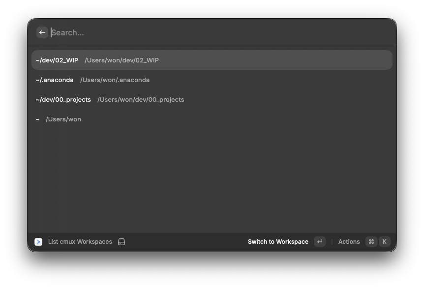
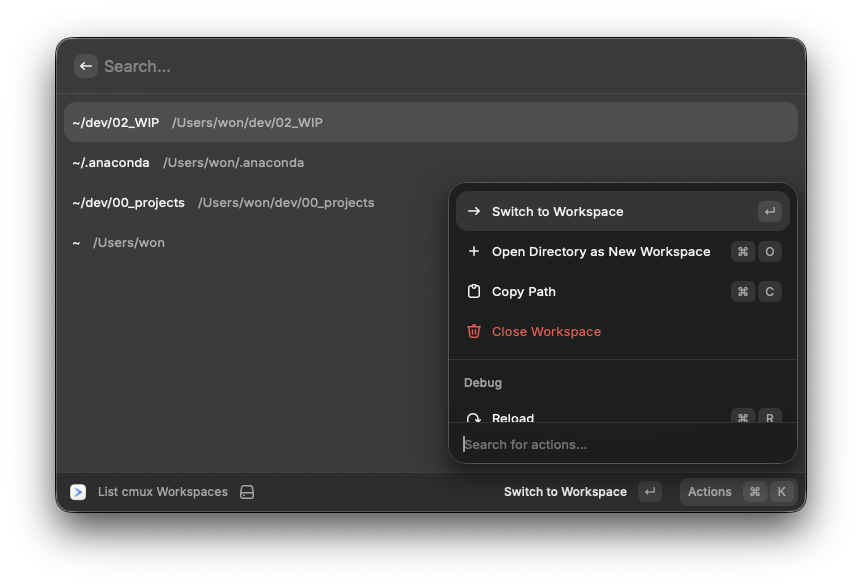

# cmux

Control [cmux](https://cmuxterm.app) — the GPU-accelerated terminal multiplexer — directly from Raycast. Browse and switch workspaces instantly, or open any Finder folder as a new workspace without touching the mouse.

## Requirements

- [cmux](https://cmuxterm.app) installed
- cmux **Socket Control** set to **Automation mode**
  - Open cmux → Settings → Socket Control → Automation

## Commands

### List cmux Workspaces

Browse all your cmux workspaces and switch to them instantly.

| Action | Shortcut |
|--------|----------|
| Switch to workspace | Enter |
| Open directory as new workspace | ⌘O |
| Copy directory path | ⌘C |
| Close workspace | ⌘⌫ |

The workspace list is cached locally and refreshes automatically every 2 seconds. If cmux is not running, the last known list is shown — selecting a workspace will launch cmux and switch to it automatically.

### Open in cmux

Opens the currently selected item in Finder as a new cmux workspace.

- Folder selected → opens that folder
- File selected → opens the file's parent folder
- No selection → opens the current Finder window's folder

Works whether cmux is running or not. If cmux is off, it launches automatically and opens the workspace.

## Preferences

| Preference | Default | Description |
|------------|---------|-------------|
| cmux CLI Path | `/opt/homebrew/bin/cmux` | Path to the cmux CLI binary (change if installed elsewhere) |
